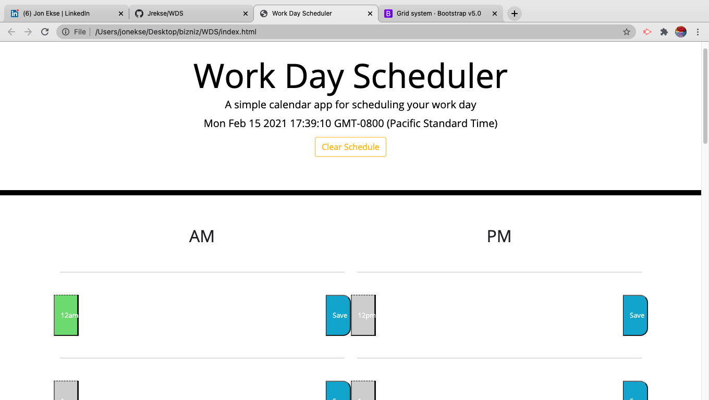

# WDS

LINK TO DEPLOYED APP: https://jrekse.github.io/Jrekse/

The page is set up with a table seperated into three columns. 1-10-1 with the time stamp and save buttons on either end with a text area in the center and 
 tags to seperate each row as shown below

<table>
    

    

        <button class="col-1 hour" id="9">9am</button>
        <textarea class="col-10 description" id="9-text"></textarea>
        <button class="col-1 saveBtn" id="9-save">Save</button>
    

    

    

        <button class="col-1 hour" id="10">10am</button>
        <textarea class="col-10 description" id="10-text"></textarea>
        <button class="col-1 saveBtn" id="10-save">Save</button>
    

    

    ...
At the bottom of the page there is a yellow button that will clear the local storage and refresh the page to display the empty text areas
In the javascript there are several variables that assign hours and grab the current hour from dayjs

 var currentHour = dayjs().hour();
 var nineAm = 9;
 var tenAm = 10;
 var elevenAm = 11;
 var twelvePm = 12;
 var onePm = 13;
 var twoPm = 14;
 var threePm = 15;
 var fourPm = 16;
 var fivePm = 17;

 //puts hours into an array to be looped through
 var hourOfDay = [nineAm,tenAm,elevenAm,twelvePm,onePm,twoPm,threePm,fourPm,fivePm];

 these results are looped through and passed through several filters, the first being color assignment based on the current time

 for (i = 0; i < hourOfDay.length; i++){
   //checks for the current hour and matches it to an array item
   if (hourOfDay[i] === currentHour){
     //asks which hour it is specifically, then sorts hour to be color coded on the UI (lines 122 - 207)
     if (hourOfDay[i] === nineAm){
       document.getElementById("9").setAttribute("class", "col-1 present")
     }
     if (hourOfDay[i] === tenAm){
       document.getElementById("10").setAttribute("class", "col-1 present")
     }
     

This pattern repeates for a long time assigning present past and future...

Next the localstorage has to be able to grab the user input from the text area and save it, inside the button events each calls its respective function shown after this example

    document.getElementById("9-save").addEventListener("click",function(){
     var nineText = document.getElementById("9-text").value;
     localStorage.setItem("nVal", nineText);
     nineFunction();
   });
   document.getElementById("10-save").addEventListener("click",function(){
     var tenText = document.getElementById("10-text").value;
     localStorage.setItem("tenVal", tenText);
     tenFunction();
   })
   document.getElementById("11-save").addEventListener("click",function(){
     var elevenText = document.getElementById("11-text").value;
     localStorage.setItem("elevenVal", elevenText);
     elevenFunction();
   })
   .....

local storage functions that are called above vv

function nineFunction(){
     var nineStored = localStorage.getItem("nVal");
     document.getElementById("9-text").innerHTML = nineStored;
   }
   function tenFunction(){
     var tenStored = localStorage.getItem("tenVal");
     document.getElementById("10-text").innerHTML = tenStored;
   }
   function elevenFunction(){
     var elevenStored = localStorage.getItem("elevenVal");
     document.getElementById("11-text").innerHTML = elevenStored;
   }
   .....

   The functions above grab each locally stored value and print it to the respective text areas. These functions are also called en mass at the start of the javascript to ensure if there are any values stored they will appear when you open the website.

  this function clears localstorage and refreshes the page

   document.getElementById("clear-btn").addEventListener("click", function(){
     localStorage.clear();
     location.reload();
   })